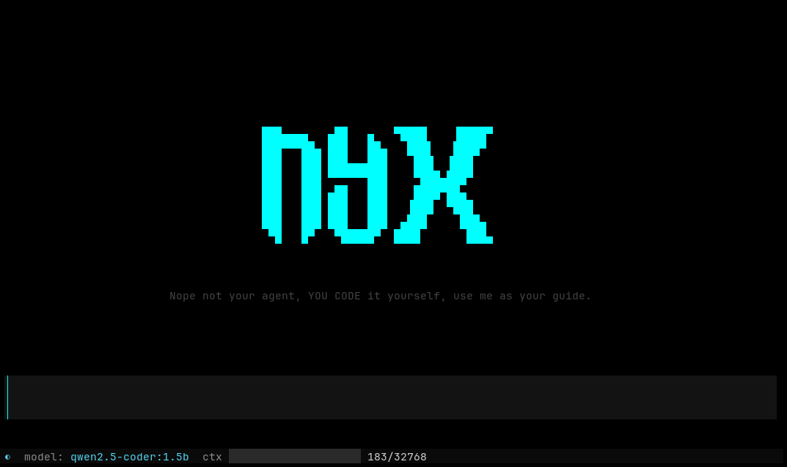

<div align="center">



### Nope not your agent, YOU CODE it yourself, use me as your guide.

Nyx is an AI harness built with documentation. Use it when you're stuck on syntax,
when you want to understand how a language works, or when you just want to learn.
However you use it, you write the code — Nyx is your guide, not your agent.

It automatically pulls docsets from [DevDocs](https://devdocs.io) and uses an
Ollama model of your choice to act as a smart documentation guide that helps
you code, not code for you.

</div>

---

## Requirements

- Python 3.11+
- [Ollama](https://ollama.com) running locally

## Install

```bash
pipx install git+https://github.com/mrgonzales-dev/nyx-harness.git
```

Make sure Ollama is installed and running:

```bash
# Install Ollama
curl -fsSL https://ollama.com/install.sh | sh

# Start the server
ollama serve

# Pull a model
ollama pull qwen2.5-coder:1.5b
```

## Usage

```bash
nyx-harness
```

### Doc Browser

Browse official documentation offline — no browser needed. Docsets are
downloaded from [DevDocs](https://devdocs.io) and cached locally under
`~/.local/share/nyx/docs/`.

**Install a docset:**

```
/docs install python~3.12
/docs install go
```

**Browse Docs:**

```
/docs python~3.12
```

This opens a full-screen modal with two states:

1. **Search** — fuzzy-filter the docset's index by typing. Arrow keys to
   navigate, Enter to open a page.
2. **Reading** — the page renders as formatted markdown with syntax
   highlighting. Scroll with arrow keys or mouse wheel.

**Feed to AI** — this feeds to the AI your selected context from the doc page. While reading a doc page:

- **Select any Context** to highlight your selected context
- Press **`a`** to send the selected text to the chat as context, then ask
  a question about it!
- Use **`/followup <question>`** to re-injects the last docs context to the AI and asks a follow-up question.


**Manage docsets:**
```
/docs list              — show installed docsets
/docs available [query] — browse downloadable docsets
```

**While in the docs browser:**

| Key | Action |
|-----|--------|
| `enter` | Open selected page |
| `mouse drag` | Select text |
| `a` | Feed selection to AI |
| `esc` / `backspace` | Back to search (or close) |
| `q` | Close browser |

## Commands

| Command | Description |
|---------|-------------|
| `/model [name]` | Switch model (or Ctrl+P for picker) |
| `/models` | List available models |
| `/system <prompt>` | Set system prompt |
| `/code` | Toggle code mode — strips responses to code blocks only, sets temperature to 0.0 |
| `/docs <slug>` | Browse an installed docset |
| `/docs install <name>` | Download a docset |
| `/docs list` | Show installed docsets |
| `/docs available [query]` | Browse available docsets |
| `/followup <question>` | Re-inject last doc and ask |
| `/clear` | Clear conversation history |
| `/compact` | Manually compact conversation |
| `/context` | Show context usage breakdown |
| `/config` | Adjust settings |
| `/status` | Show current config |
| `/help` | Show available commands |
| `/quit` | Exit (or Ctrl+Q) |

### Code Mode (`/code`)

When you only want the code, toggle `/code` on. The harness modifies the system prompt
to request code-only output and forces the model to temperature 0.0 for deterministic
results. Non-code text is stripped from both the display and the conversation context
— only fenced code blocks survive.

The header changes to `☾ NYX [code mode]` so you know it's active. Toggle `/code` again
to restore your original system prompt and temperature.

### Missing Model

If the default model (`qwen2.5-coder:1.5b`) is not installed at startup, a modal offers
to download it, pick a different model, or continue without one if you already have
other models available.

## Install

```bash
pipx install git+https://github.com/mrgonzales-dev/nyx-harness.git
```

Make sure Ollama is installed and running:

```bash
# Install Ollama
curl -fsSL https://ollama.com/install.sh | sh

# Start the server
ollama serve

# Pull a model (or skip — the app can download it for you)
ollama pull qwen2.5-coder:1.5b
```

## License

[MIT](LICENSE)
